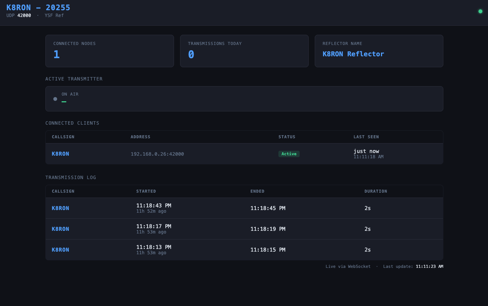

# ysf-reflector-go

A [Yaesu System Fusion (YSF)](https://www.yaesu.com/jp/en/wires-x/index.php) UDP reflector written in Go. It links
multiple YSF nodes and hotspots together, relaying voice and data frames between all connected clients.

## Features

- Handles the full YSF UDP protocol: `YSFP` (poll/keepalive), `YSFD` (voice/data), `YSFU` (unlink), and `YSFS` (status
  query)
- Relays incoming frames to all connected nodes except the sender
- Proactively polls clients every 5 seconds to detect drops early
- Evicts idle clients after a configurable timeout
- Transmission watchdog — logs when a transmission starts and ends
- Periodic status dumps every 2 minutes
- Optional per-packet debug logging
- Parrot mode — buffers each transmission and replays it to all connected nodes after TX ends
- HTTP dashboard showing connected nodes in real time
- `/api/clients` JSON endpoint for programmatic access
- Bridge system — link to remote YSF reflectors with always-on or cron-scheduled connect/disconnect



## Requirements

- Go 1.21+

## Docker

Pre-built images are published to Docker Hub at [
`siteworxpro/ysf-reflector-go`](https://hub.docker.com/r/siteworxpro/ysf-reflector-go).

### Quick start

Create a `config.yaml` (see [Configuration](#configuration) below), then run:

```sh
docker run -d \
  --name ysf-reflector \
  -v /path/to/config.yaml:/etc/ysf-reflector/config.yaml \
  -p 42000:42000/udp \
  -p 8080:8080 \
  siteworxpro/ysf-reflector-go
```

### Docker Compose

```yaml
services:
  ysf-reflector:
    image: siteworxpro/ysf-reflector-go:latest
    restart: unless-stopped
    volumes:
      - ./config.yaml:/etc/ysf-reflector/config.yaml
    ports:
      - "42000:42000/udp"
      - "8080:8080"
```

### Building the image locally

```sh
docker build -t ysf-reflector .

# With a version label
docker build --build-arg VERSION=1.2.3 -t ysf-reflector:1.2.3 .
```

The config file is expected at `/etc/ysf-reflector/config.yaml` inside the container.

## Building

```sh
go build -o ysf-reflector .
```

## Configuration

Copy and edit `config_example.yaml` to `config.yaml`:

```yaml
callsign: K8RON          # Your reflector callsign (max 10 characters)
port: 42000              # UDP port to listen on (standard YSF port is 42000)
http_port: 8080          # HTTP dashboard port
timeout: 240             # Seconds before an idle client is disconnected
debug: false             # Log every packet (verbose)
parrot: false            # Buffer each transmission and replay it to all nodes after TX ends

# Reported in YSFS status query responses
id: 0                    # Numeric reflector ID (reported to querying nodes)
name: K8RON Reflector    # Reflector name (max 16 characters)
description: YSF Ref     # Short description (max 14 characters)

# WebSocket origin allowlist (optional — omit for same-origin enforcement)
#allowed_origins:
#  - https://dashboard.example.com
#  - http://192.168.1.10:8080
```

| Field              | Required | Default | Description                                                                        |
|--------------------|----------|---------|------------------------------------------------------------------------------------|
| `callsign`         | Yes      | —       | Reflector callsign, max 10 characters                                              |
| `port`             | No       | `42000` | UDP port to listen on                                                              |
| `http_port`        | No       | `8080`  | HTTP dashboard port                                                                |
| `timeout`          | No       | `240`   | Client idle timeout in seconds                                                     |
| `debug`            | No       | `false` | Log every packet                                                                   |
| `parrot`           | No       | `false` | Buffer TX and replay to all nodes after TX ends                                    |
| `id`               | No       | `0`     | Numeric ID included in YSFS status responses                                       |
| `name`             | No       | —       | Reflector name, max 16 characters                                                  |
| `description`      | No       | —       | Short description, max 14 characters                                               |
| `allowed_origins`  | No       | —       | WebSocket origin allowlist (list of `scheme://host[:port]`); see [Web dashboard](#web-dashboard) |
| `bridges`          | No       | —       | List of outbound bridges to remote YSF reflectors; see [Bridge system](#bridge-system) |

## Bridge system

Bridges let this reflector connect to one or more remote YSF reflectors. Frames from local nodes are forwarded to the remote, and frames received from the remote are injected back into the local reflector and relayed to all connected nodes.

Each bridge can operate in two modes:

- **Always-on** — connects at startup and stays connected indefinitely.
- **Scheduled** — connects and disconnects on cron expressions (standard 5-field format).

```yaml
bridges:
  # Always-on bridge — connects at startup and stays connected.
  - name: K9XYZ Reflector
    host: ysf.example.com
    port: 42000
    always_on: true
    enabled: true

  # Scheduled bridge — connect at 08:00, disconnect at 22:00, every day.
  - name: Night Net Link
    host: 192.0.2.10
    port: 42000
    callsign: K8BRIDGE    # override callsign sent to remote (optional)
    connect:    "0 8 * * *"
    disconnect: "0 22 * * *"
    enabled: true

  # Weekday-only bridge — connect Mon–Fri at 09:00, disconnect at 17:00.
  - name: Weekday Net
    host: ysf2.example.com
    port: 42000
    connect:    "0 9 * * 1-5"
    disconnect: "0 17 * * 1-5"
    enabled: true
```

### Bridge config fields

| Field        | Required | Default | Description                                                        |
|--------------|----------|---------|--------------------------------------------------------------------|
| `name`       | Yes      | —       | Human-readable label for logs                                      |
| `host`       | Yes      | —       | Remote reflector hostname or IP                                    |
| `port`       | No       | `42000` | Remote reflector UDP port                                          |
| `callsign`   | No       | —       | Override callsign sent to remote (max 10 chars); defaults to reflector callsign |
| `always_on`  | No       | `false` | Connect at startup and stay connected                              |
| `connect`    | No       | —       | 5-field cron expression controlling when to connect                |
| `disconnect` | No       | —       | 5-field cron expression controlling when to disconnect             |
| `enabled`    | No       | `false` | Must be `true` to activate the bridge                             |

### Cron expression syntax

Cron fields: `minute hour day-of-month month day-of-week`

| Syntax  | Example      | Meaning                        |
|---------|--------------|--------------------------------|
| `*`     | `*`          | Every value                    |
| `N`     | `30`         | Exact value                    |
| `N-M`   | `1-5`        | Inclusive range                |
| `*/N`   | `*/15`       | Every N steps from minimum     |
| `N-M/N` | `8-18/2`     | Range with step                |
| `N,M`   | `1,3,5`      | Comma-separated list           |

## Running

```sh
./ysf-reflector -config config.yaml
```

The `-config` flag defaults to `config.yaml` in the current directory.

## Web dashboard

When the reflector is running, a live dashboard is available at `http://localhost:8080` (or whatever `http_port` is set
to). It lists all currently connected nodes with their callsign, IP address, and time since last heard. The dashboard
uses a WebSocket connection to receive live updates.

### WebSocket origin policy

By default the server enforces **same-origin** — only a browser that loaded the dashboard page from the same
`host:port` may open a WebSocket connection. This prevents cross-site WebSocket hijacking from third-party pages.

If the dashboard is served behind a reverse proxy or accessed from a different hostname, add the trusted origins to
`allowed_origins` in `config.yaml`:

```yaml
allowed_origins:
  - https://dashboard.example.com
  - http://192.168.1.10:8080
```

When `allowed_origins` is set, only those exact origins are permitted; the same-origin fallback is bypassed.
Non-browser clients (e.g. `curl`, native apps) that omit the `Origin` header are always allowed through.

A JSON API is also available for programmatic access:

```
GET /api/clients
```

```json
[
  {
    "callsign": "K8RON",
    "addr": "1.2.3.4:42000",
    "last_seen": "2026-04-10T17:00:00Z"
  }
]
```

## Protocol overview

| Magic | Direction                     | Description                                                                |
|-------|-------------------------------|----------------------------------------------------------------------------|
| YSFP  | node ↔ reflector              | Keepalive poll / registration                                              |
| YSFD  | node → reflector → all others | Voice/data frame relay                                                     |
| YSFU  | node → reflector              | Unlink / disconnect request                                                |
| YSFS  | node → reflector              | Status query; reflector replies with ID, name, description, and node count |

## License

Copyright 2026 Siteworxpro LLC

Permission is hereby granted, free of charge, to any person obtaining a copy of this software and associated
documentation files (the “Software”), to deal in the Software without restriction, including without limitation the
rights to use, copy, modify, merge, publish, distribute, sublicense, and/or sell copies of the Software, and to permit
persons to whom the Software is furnished to do so, subject to the following conditions:

The above copyright notice and this permission notice shall be included in all copies or substantial portions of the
Software.

THE SOFTWARE IS PROVIDED “AS IS”, WITHOUT WARRANTY OF ANY KIND, EXPRESS OR IMPLIED, INCLUDING BUT NOT LIMITED TO THE
WARRANTIES OF MERCHANTABILITY, FITNESS FOR A PARTICULAR PURPOSE AND NONINFRINGEMENT. IN NO EVENT SHALL THE AUTHORS OR
COPYRIGHT HOLDERS BE LIABLE FOR ANY CLAIM, DAMAGES OR OTHER LIABILITY, WHETHER IN AN ACTION OF CONTRACT, TORT OR
OTHERWISE, ARISING FROM, OUT OF OR IN CONNECTION WITH THE SOFTWARE OR THE USE OR OTHER DEALINGS IN THE SOFTWARE.
